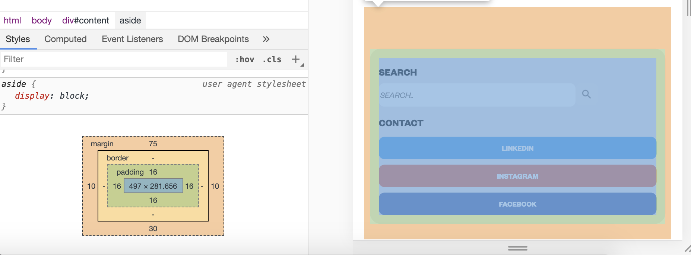
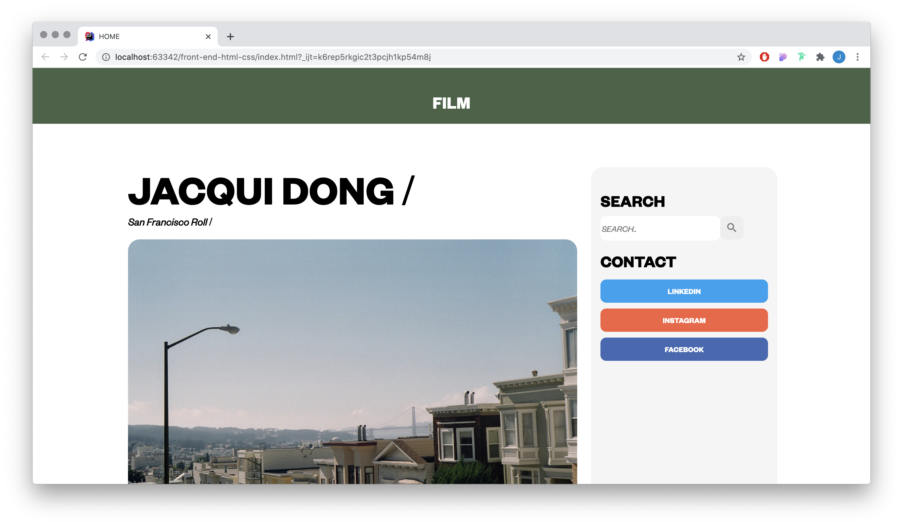
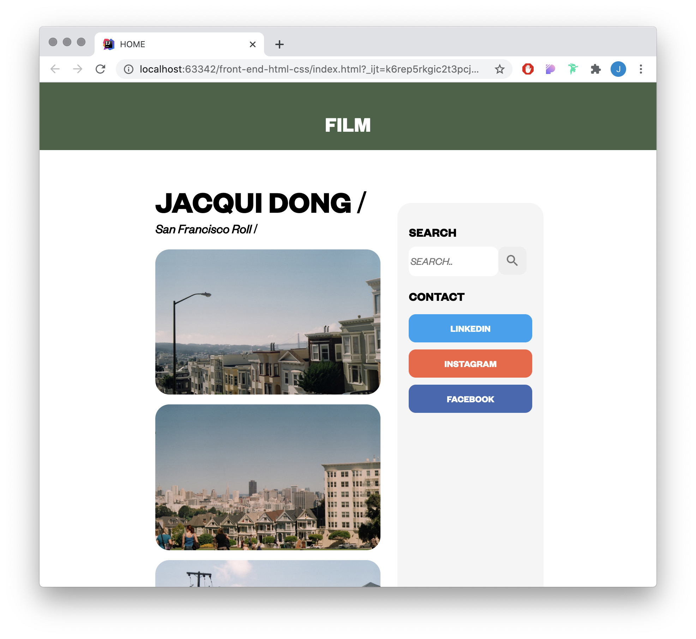
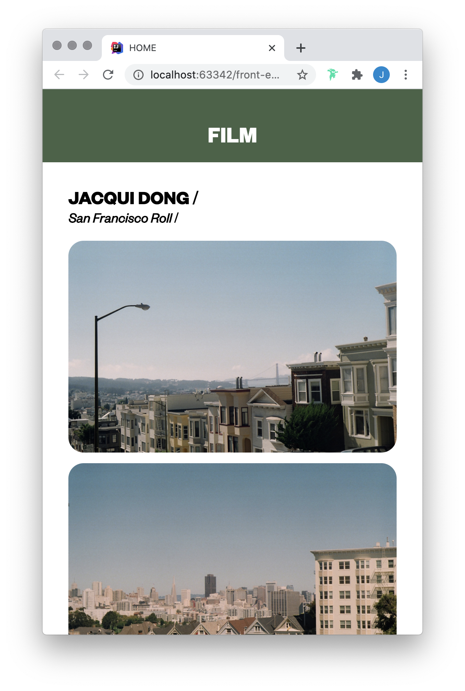

# FILM webpage

The webpage I have created is called 'FILM'. FILM showcases various pictures of San Francisco taken with on a film camera and displays a search bar and contact links to Facebook, LinkedIn and Instagram.

I have used the both Flex Box and Box Model for the styling of FILM.

### Box Model
The CSS Box Model is a box that wraps around every HTML element, composed of margin, padding, border, and the element content.
The margin, padding and border set space on all four sides of the content; left, right, top and bottom. Below is a diagram of the Box Model.

In my webpage, I have used the Box Model to add padding, margins and border decorations to my elements.
Each box manipulates the elements in a different way.

One way I've used the Box Model on an element is on the Side Search and Contact bar, as shown below.

From the coloured guides, we can see that the content I currently have selected is blue. I used padding to generate space around the content and within the elements borders. I have used a value of 15px for padding within the whole element, which means that there will be 15px of space around the content on all four sides.

I have also used a margin value around the whole of the content. The margin value creates space around the content and outside of the elements borders. Using the margin values is helpful for moving the element around and creating gaps between different elements. 

### Additional Features
In this FILM webpage, I have included the following elements:

##### Sematic HTML
Sematic HTML clearly describes the meaning of the element to both the browser and the developer. Using these tags increases the readability of the code which is important for developers. Some examples I have used are

``<form>`` for the Search Bar input and LinkedIn clickable redirect button.

``<article>`` for the main content within the page.

``<aside>`` for the side panel containing the search bar and contact buttons.

##### Scalability
I used the Flex Box CSS Layout which allows the webpage to be responsive and scalable. Using Flexbox allowed me to evenly distribute by elements on the page.

Another element I used for a responsive layout was by using the ``@media`` tag in my CSS. This tag allowed me to specify a query which would apply CSS to the document if the media query width matched the device. 

Examples below:

##### CSS

To style my webpage, I used CSS.